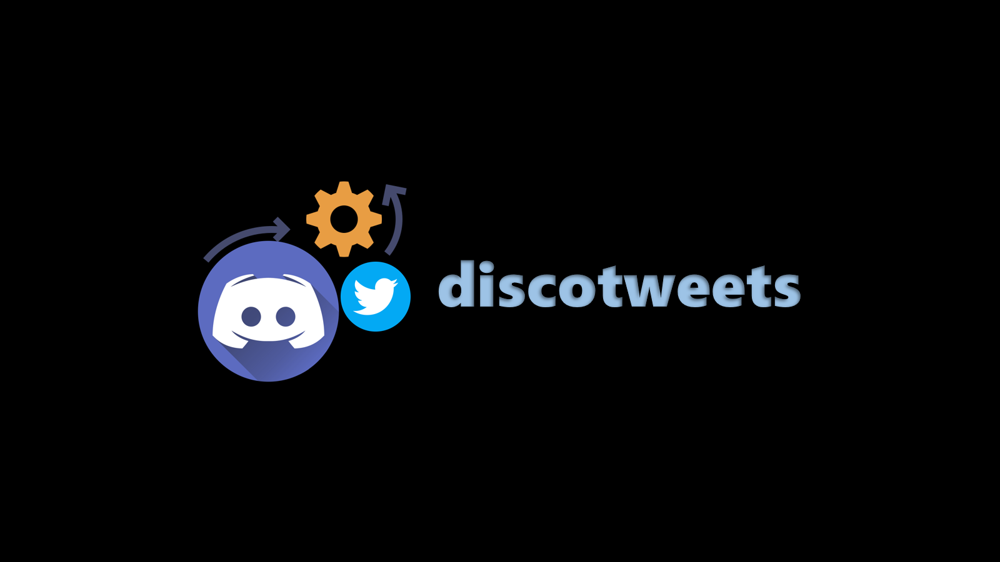

    
    
    
    
    

# DiscoTweets

DiscoTweets is a powerful project that allows you to convert Discord events into messages and automatically tweet them on your Twitter account and on discord channel on schedule. This project utilizes API integration to connect Discord and Twitter, ensuring a smooth and efficient process.

### How to use
* Fork this repository.
* Set secrets. Learn how to create repository secrets [here](https://docs.github.com/en/actions/security-guides/encrypted-secrets).
* In total 8 secret need to be set. Read the [actions](https://github.com/aps08/discotweets/blob/main/.github/workflows/actions.yml) file line number 27 to see what secret name should be passed.

<strong>If you liked something about this repository, do give it a 🌟. It will motivate me come up with more such project. You can reach out to me on my social media given below.</strong>

 
 
 
 
 
 
 

